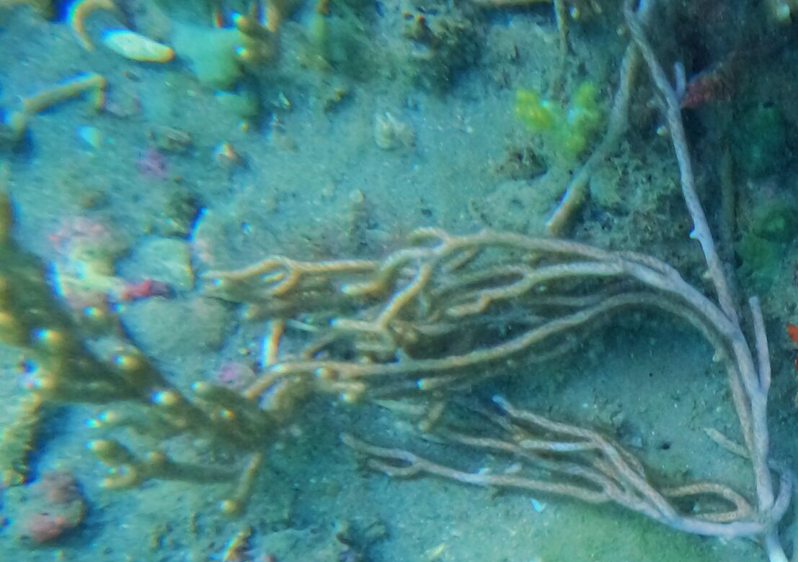
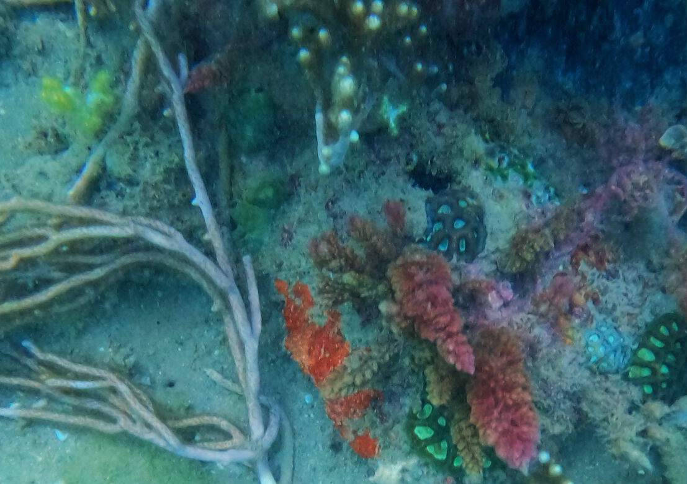
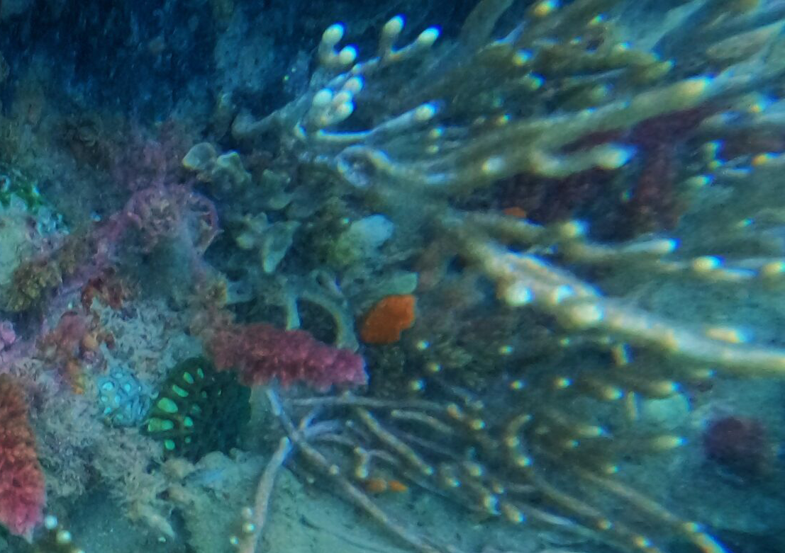
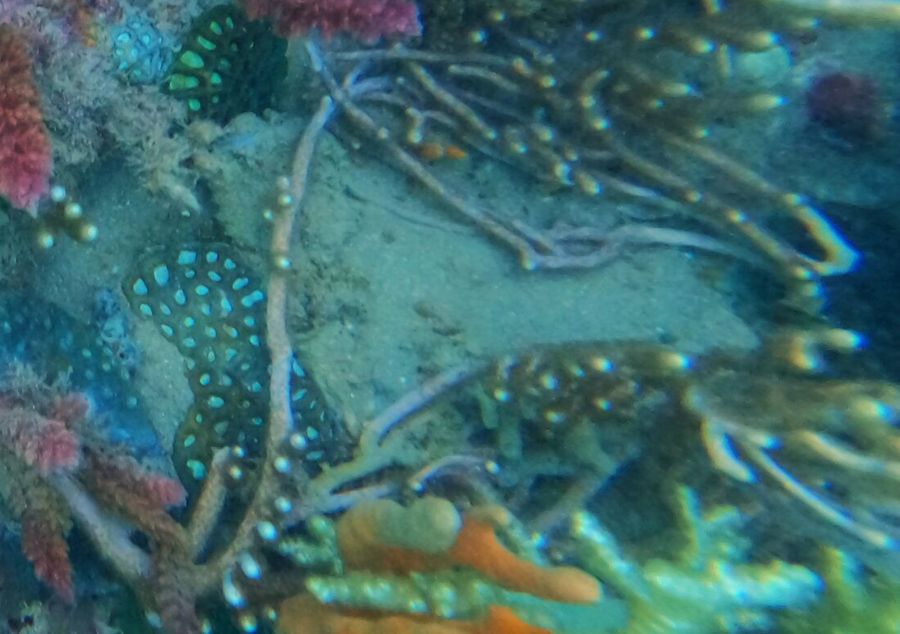
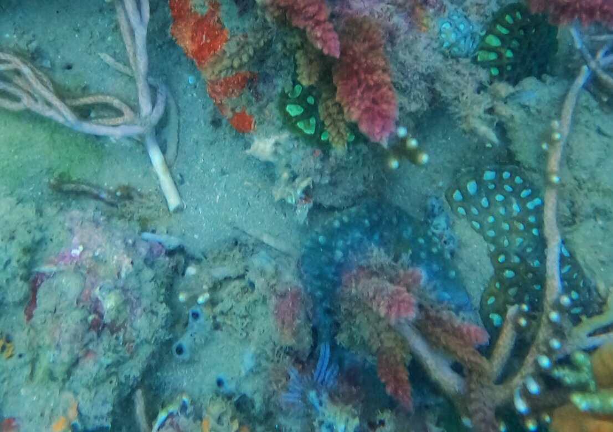
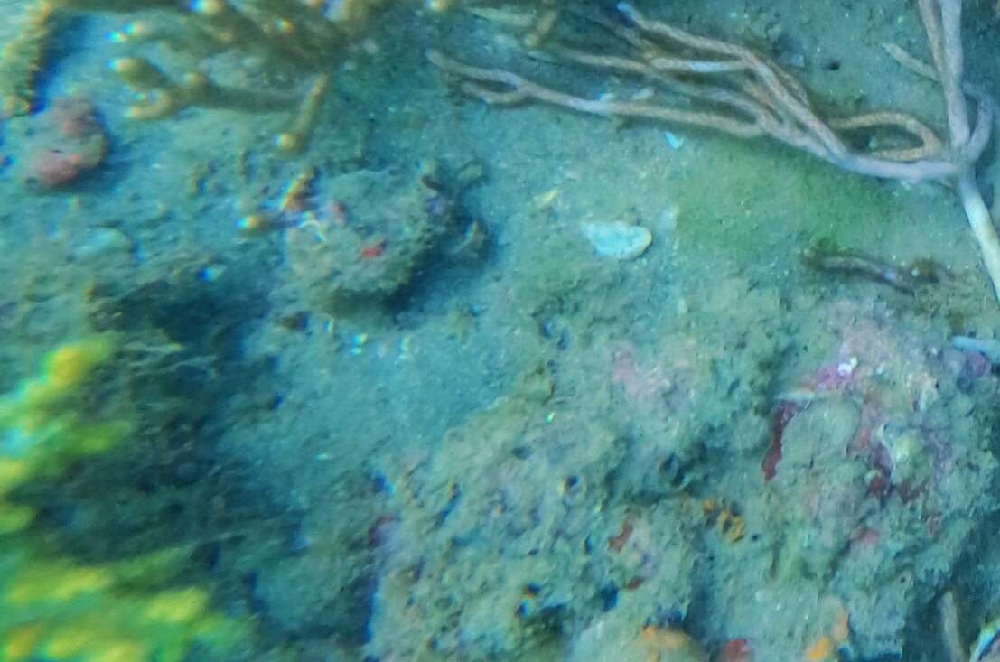

# Photo Stitching Module
**Author :** [Pi Ko](https://paingthet.com/) ([pk2269@nyu.edu](mailto:pk2269@nyu.edu))

# Input Files

# Processing and Output

### Feature Extraction

### Matching Features

### Seam Masking

### Results

