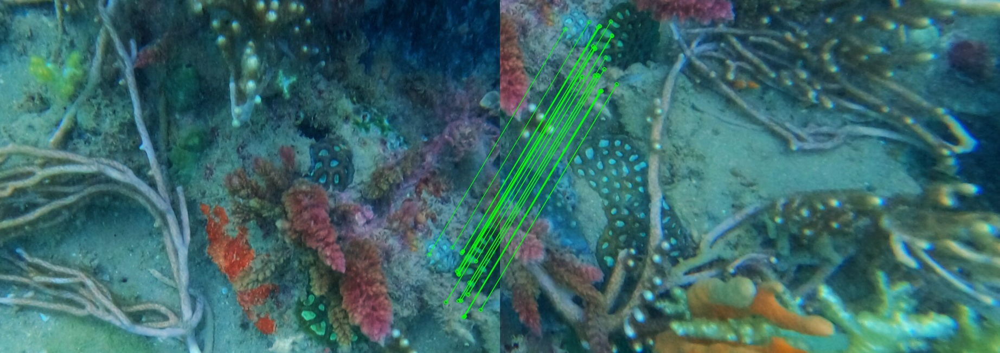
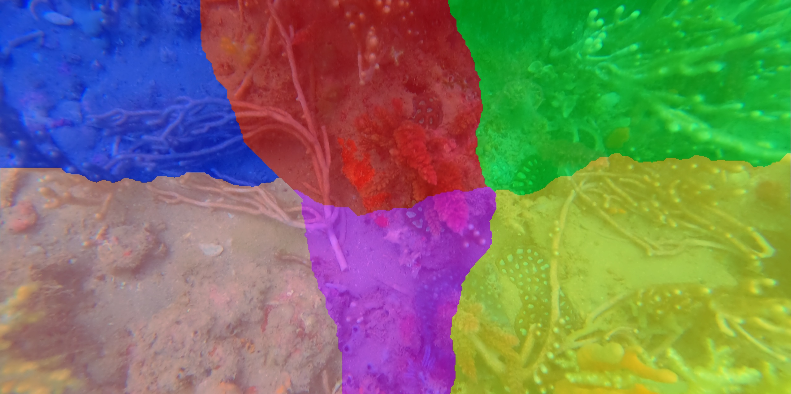

# Photo Stitching Module
**Author :** [Pi Ko](https://paingthet.com/) ([pk2269@nyu.edu](mailto:pk2269@nyu.edu))


[](https://forthebadge.com)

[](https://forthebadge.com)

A Python package for RoV Image Stitching.

Based on opencv's [stitching
module](https://github.com/opencv/opencv/tree/4.x/modules/stitching)

## Installation

use the [docker image](#docker-cli)

or `pip` to install `stitching` from
[PyPI](https://pypi.org/project/stitching/).

```bash
pip install stitching
```

## Usage

```python
stitch.py [Directory]\*.png -v --confidence_threshold=0.9 --detector="orb"
```

Important Notes:
- The images must have a signifiant overlap
- Must adjust the confidence threshold or use a new detector if it fails

# I/O Results


# Processing and Output

### Feature Extraction


### Matching Features


### Seam Masking


### Results


